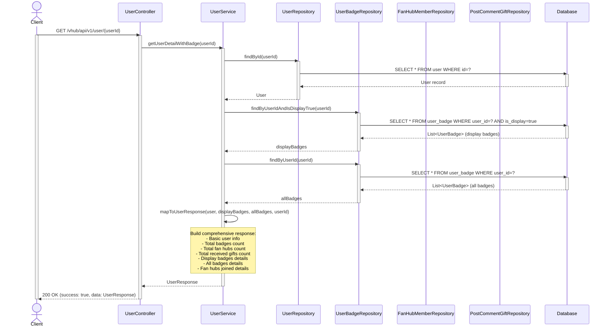
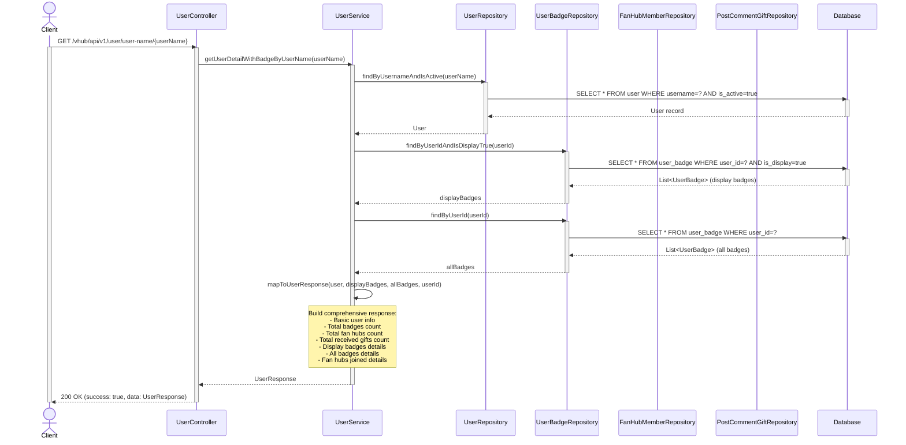

# Sequence Diagrams for Authentication Flows

## 1. Sign Up with Email & OTP Verification

```mermaid
sequenceDiagram
    actor Client
    participant UserController
    participant OtpService
    participant EmailService
    participant UserService
    participant PasswordEncoder
    participant OtpRepo as OtpVerificationRepository
    participant UserRepo as UserRepository
    participant DB as Database

    Note over Client,DB: Phase 1: OTP Generation & Email Sending
    Client->>UserController: POST /vhub/api/v1/user/verify?email={email}
    activate Client
    activate UserController
    UserController->>OtpService: generateOtp(email)
    activate OtpService
    
    OtpService->>OtpRepo: countByEmailAndCreatedAtAfter(email, 1hr ago)
    activate OtpRepo
    OtpRepo->>DB: COUNT query
    activate DB
    DB-->>OtpRepo: otpCount (e.g., 3)
    deactivate DB
    OtpRepo-->>OtpService: otpCount
    deactivate OtpRepo
    
    alt otpCount >= 10
        OtpService-->>UserController: RateLimitException
        UserController-->>Client: 429 Too many OTP requests
    else otpCount < 10
        OtpService->>OtpService: Generate random 6-digit OTP
        OtpService->>OtpRepo: save(otpVerification)
        activate OtpRepo
        OtpRepo->>DB: INSERT otp_verification
        activate DB
        Note over DB: Store OTP with 5-min expiry
        DB-->>OtpRepo: saved record
        deactivate DB
        OtpRepo-->>OtpRepo: saved record
        deactivate OtpRepo

        OtpService-->>UserController: otp (6-digit code)
        deactivate OtpService

        UserController->>EmailService: sendOtpEmail(email, otp)
        activate EmailService
        Note over EmailService: Send HTML email with OTP
        EmailService-->>UserController: email sent
        deactivate EmailService

        UserController-->>Client: 200 OK (success: true, otp)
    else otpCount >= 10
        OtpService-->>UserController: RateLimitException
        UserController-->>Client: 429 Too many OTP requests
    end
    deactivate UserController
    deactivate Client

    Note over Client,DB: Phase 2: User Registration with OTP Verification
    Client->>UserController: POST /vhub/api/v1/user/register<br/>(username, email, password, otp, etc.)
    activate Client
    activate UserController
    
    UserController->>OtpService: verifyOtp(email, otp)
    activate OtpService
    OtpService->>OtpRepo: findTopByEmailOrderByExpiresAtDesc(email)
    activate OtpRepo
    OtpRepo->>DB: SELECT latest OTP record
    activate DB
    DB-->>OtpRepo: latest OTP record
    deactivate DB
    OtpRepo-->>OtpService: latest OTP record
    deactivate OtpRepo

    alt OTP Valid
        Note over OtpService: Check: record exists AND<br/>otp code matches AND<br/>not expired (within 5 min)
        OtpService->>OtpRepo: setIsUsed(true)
        activate OtpRepo
        OtpRepo->>DB: UPDATE otp_verification SET is_used=true
        activate DB
        DB-->>OtpRepo: updated
        deactivate DB
        OtpRepo-->>OtpService: updated
        deactivate OtpRepo
        OtpService-->>UserController: true (verified)
        deactivate OtpService
    else OTP Invalid
        Note over OtpService: OTP mismatch or expired
        OtpService-->>UserController: false (not verified)
        deactivate OtpService
    end
    
    alt OTP Verified
        UserController->>UserService: createUser(request)
        activate UserService
        
        UserService->>UserRepo: existsByUsername(username)
        activate UserRepo
        UserRepo->>DB: COUNT WHERE username=?
        activate DB
        DB-->>UserRepo: exists (boolean)
        deactivate DB
        UserRepo-->>UserService: boolean
        deactivate UserRepo

        alt Username exists
            UserService-->>UserController: "Username is already in use"
            deactivate UserService
            UserController-->>Client: 200 OK (success: true, data: error message)
        else Username available
            UserService->>UserRepo: existsByEmail(email)
            activate UserRepo
            UserRepo->>DB: COUNT WHERE email=?
            activate DB
            DB-->>UserRepo: exists (boolean)
            deactivate DB
            UserRepo-->>UserService: boolean
            deactivate UserRepo

            alt Email exists
                UserService-->>UserController: "Email is already in use"
                deactivate UserService
                UserController-->>Client: 200 OK (success: true, data: error message)
            else Email available
                UserService->>PasswordEncoder: encode(password)
                activate PasswordEncoder
                PasswordEncoder-->>UserService: hashedPassword
                deactivate PasswordEncoder

                UserService->>UserRepo: save(newUser)
                activate UserRepo
                UserRepo->>DB: INSERT user
                activate DB
                Note over DB: Create User with:<br/>- hashed password<br/>- isActive=true<br/>- points=0<br/>- timestamps
                DB-->>UserRepo: saved user
                deactivate DB
                UserRepo-->>UserService: saved user
                deactivate UserRepo

                UserService-->>UserController: success message
                UserController-->>Client: 200 OK (success: true, data: user created)
                deactivate UserService
            end
        end
    else OTP Not Verified
        UserController-->>Client: 200 OK (success: true, message: "Fail", data: "Can not register user")
        deactivate UserService
    end
    deactivate UserController
    deactivate Client
end
```

---

## 2. Sign In with Username and Password

```mermaid
sequenceDiagram
    actor Client
    participant AuthController
    participant AuthService
    participant JWTService
    participant RefreshTokenService
    participant UserRepo as UserRepository
    participant RefreshTokenRepo as RefreshTokenRepository
    participant DB as Database
    participant PasswordEncoder

    Client->>AuthController: POST /vhub/api/v1/auth/login<br/>(username, password)
    activate Client
    activate AuthController
    
    AuthController->>AuthService: login(username, password)
    activate AuthService
    
    AuthService->>UserRepo: findByUsernameAndIsActive(username)
    activate UserRepo
    UserRepo->>DB: SELECT WHERE username=? AND is_active=true
    activate DB
    DB-->>UserRepo: User record
    deactivate DB
    UserRepo-->>AuthService: Optional<User>
    deactivate UserRepo
    
    alt User Not Found
        AuthService-->>AuthController: CustomAuthenticationException<br/>("Invalid username or password")
        deactivate AuthService
        AuthController-->>Client: 401 Unauthorized (error response)
    else User Found
        AuthService->>PasswordEncoder: matches(password, user.passwordHash)
        activate PasswordEncoder
        Note over PasswordEncoder: Compare plaintext password<br/>with stored BCrypt hash
        PasswordEncoder-->>AuthService: boolean (match result)
        deactivate PasswordEncoder

        alt Password Mismatch
            AuthService-->>AuthController: CustomAuthenticationException<br/>("Invalid username or password")
            deactivate AuthService
            AuthController-->>Client: 401 Unauthorized (error response)
        else Password Match
            AuthService->>AuthService: Create LoginResponse
            Note over AuthService: loginResponse.id = user.id<br/>loginResponse.username = user.username

            AuthService->>JWTService: generateToken(user)
            activate JWTService
            Note over JWTService: Generate JWT with:<br/>- subject=username<br/>- roles<br/>- expiration time
            JWTService-->>AuthService: jwtToken
            deactivate JWTService
            Note over AuthService: loginResponse.token = jwtToken

            AuthService->>RefreshTokenService: createRefreshToken(user)
            activate RefreshTokenService
            RefreshTokenService->>RefreshTokenService: Generate UUID refresh token
            RefreshTokenService->>RefreshTokenRepo: save(refreshToken)
            activate RefreshTokenRepo
            RefreshTokenRepo->>DB: INSERT refresh_token
            activate DB
            Note over DB: Store refresh token<br/>with user reference<br/>and expiry timestamp
            DB-->>RefreshTokenRepo: saved token
            deactivate DB
            RefreshTokenRepo-->>RefreshTokenService: saved token
            deactivate RefreshTokenRepo
            RefreshTokenService-->>AuthService: refreshTokenString
            deactivate RefreshTokenService
            Note over AuthService: loginResponse.refreshToken = refreshTokenString

            AuthService-->>AuthController: LoginResponse (id, username, token, refreshToken)
            deactivate AuthService
        end
    end
    
    AuthController-->>Client: 200 OK<br/>(success: true,<br/>data: LoginResponse)
    deactivate AuthController
    deactivate Client
```

---

## Key Components Legend

| Component | Responsibility |
|-----------|----------------|
| **UserController** | Handles registration endpoints, orchestrates OTP verification and user creation |
| **AuthController** | Handles login endpoint, returns authentication response |
| **OtpService** | Generates OTP codes, verifies OTP codes, enforces rate limiting (max 10/hour) |
| **EmailService** | Sends OTP codes via email |
| **UserService** | Creates user accounts with validation and password hashing |
| **AuthService** | Authenticates users with username/password, generates tokens |
| **UserRepository** | Database access for User entities |
| **OtpVerificationRepository** | Database access for OTP records |
| **PasswordEncoder** | BCrypt password hashing and verification |
| **JWTService** | JWT token generation and validation |
| **RefreshTokenService** | Refresh token generation for session renewal |

---

## 3. View Current User Profile

```mermaid
sequenceDiagram
    actor Client
    participant UserController
    participant UserService
    participant AuthService
    participant JWTService
    participant AuthRepo as Auth Components
    participant DB as Database

    Client->>UserController: GET /vhub/api/v1/user/me
    activate Client
    activate UserController
    
    UserController->>UserService: getCurrentUserDetail()
    activate UserService
    
    UserService->>AuthService: getUserFromToken(httpServletRequest)
    activate AuthService
    
    AuthService->>AuthService: Extract token from request header
    Note over AuthService: Authorization: Bearer {token}
    
    AuthService->>JWTService: getUsernameFromToken(token)
    activate JWTService
    JWTService->>JWTService: Parse JWT and extract username
    JWTService-->>AuthService: username
    deactivate JWTService
    
    AuthService->>AuthRepo: Find user by username
    activate AuthRepo
    AuthRepo->>DB: SELECT * FROM user WHERE username=?
    activate DB
    DB-->>AuthRepo: User record
    deactivate DB
    AuthRepo-->>AuthService: User object
    deactivate AuthRepo
    
    AuthService-->>UserService: User (current user)
    deactivate AuthService
    
    UserService->>UserService: Map User to UserDetailResponse
    Note over UserService: Extract:<br/>- userId, username, email<br/>- displayName, avatarUrl, frameUrl<br/>- bio, role, points, paidPoints<br/>- translateLanguage, timestamps, isActive
    
    UserService-->>UserController: UserDetailResponse
    deactivate UserService
    
    UserController-->>Client: 200 OK (success: true, data: UserDetailResponse)
    deactivate UserController
    deactivate Client
end
```

---

## 4. View User Details by ID



---

## 5. View User Details by Username



---

## 6. Update Profile

```mermaid
sequenceDiagram
    actor Client
    participant UserController
    participant UserService
    participant AuthService
    participant JWTService
    participant UserRepo as UserRepository
    participant DB as Database

    Client->>UserController: PUT /vhub/api/v1/user/update<br/>(UpdateUserRequest with fields to update)
    activate Client
    activate UserController
    Note over Client: Request body may include:<br/>- email (optional)<br/>- displayName (optional)<br/>- translateLanguage (optional)<br/>- bio (optional)
    
    UserController->>UserService: updateUser(request)
    activate UserService
    
    UserService->>AuthService: getUserFromToken(httpServletRequest)
    activate AuthService
    
    AuthService->>AuthService: Extract token from request header
    Note over AuthService: Authorization: Bearer {token}
    
    AuthService->>JWTService: getUsernameFromToken(token)
    activate JWTService
    JWTService->>JWTService: Parse JWT and extract username
    JWTService-->>AuthService: username
    deactivate JWTService
    
    AuthService->>AuthService: Find user by username
    AuthService->>DB: SELECT * FROM user WHERE username=?
    activate DB
    DB-->>AuthService: User record
    deactivate DB
    AuthService-->>UserService: User (current user)
    deactivate AuthService
    
    alt Email field provided
        UserService->>UserService: Check if email changed
        Note over UserService: if new email != current email
        
        UserService->>UserRepo: existsByEmail(newEmail)
        activate UserRepo
        UserRepo->>DB: COUNT WHERE email=?
        activate DB
        DB-->>UserRepo: exists (boolean)
        deactivate DB
        UserRepo-->>UserService: boolean
        
        alt Email already in use
            UserService-->>UserController: "Email is already in use"
            deactivate UserService
            UserController-->>Client: 200 OK (success: true, data: error message)
        else Email available
            UserService->>UserService: user.setEmail(newEmail)
            deactivate UserService
        end
    else Email field not provided
    end

    alt DisplayName field provided
        UserService->>UserService: user.setDisplayName(displayName)
    end

    alt TranslateLanguage field provided
        UserService->>UserService: user.setTranslateLanguage(translateLanguage)
    end

    alt Bio field provided
        UserService->>UserService: user.setBio(bio)
    end
    
    UserService->>UserService: user.setUpdatedAt(Instant.now())
    
    UserService->>UserRepo: save(user)
    activate UserRepo
    UserRepo->>DB: UPDATE user SET<br/>email=?, display_name=?,<br/>translate_language=?, bio=?,<br/>updated_at=?<br/>WHERE id=?
    activate DB
    DB-->>UserRepo: updated user
    deactivate DB
    UserRepo-->>UserService: saved user
    deactivate UserRepo
    
    UserService-->>UserController: "Updated user successfully"
    deactivate UserService

    UserController-->>Client: 200 OK (success: true, data: "Updated user successfully")
    deactivate UserController
    deactivate Client
end
```

---

## 7. Set Oshi

```mermaid
sequenceDiagram
    actor Client
    participant UserController
    participant UserService
    participant AuthService
    participant UserRepo as UserRepository
    participant DB as Database

    Client->>UserController: PUT /vhub/api/v1/user/set-oshi<br/>(SetOshiRequest with oshiUsername)
    activate Client
    activate UserController
    Note over Client: Request body:<br/>{ "oshiUsername": "vtuber_name" }

    UserController->>UserService: setOshi(request)
    activate UserService

    UserService->>AuthService: getUserFromToken(httpServletRequest)
    activate AuthService
    AuthService->>AuthService: Extract token from request header
    Note over AuthService: Authorization: Bearer {token}
    AuthService-->>UserService: User (current user)
    deactivate AuthService

    UserService->>UserRepo: findByUsernameAndIsActive(oshiUsername)
    activate UserRepo
    UserRepo->>DB: SELECT * FROM user WHERE username=? AND is_active=true
    activate DB
    DB-->>UserRepo: User record
    deactivate DB
    UserRepo-->>UserService: Optional<User>
    deactivate UserRepo

    alt VTuber Not Found
        UserService-->>UserController: "VTuber not found"
        deactivate UserService
        UserController-->>Client: 200 OK (success: true, data: "VTuber not found")
    else VTuber Found, check role
        Note over UserService: Check if oshiUser.role == "VTUBER"
        alt Not a VTUBER
            UserService-->>UserController: User with username '{oshiUsername}' is not a VTUBER
            deactivate UserService
            UserController-->>Client: 200 OK (success: true, data: error)
        else Is VTUBER
            UserService->>UserService: currentUser.setOshiUser(oshiUser)
            UserService->>UserService: currentUser.setUpdatedAt(Instant.now())

            UserService->>UserRepo: save(currentUser)
            activate UserRepo
            UserRepo->>DB: UPDATE user SET oshi_user_id=?,<br/>updated_at=? WHERE id=?
            activate DB
            DB-->>UserRepo: updated user
            deactivate DB
            UserRepo-->>UserService: saved user
            deactivate UserRepo

            UserService-->>UserController: Set oshi successfully
            deactivate UserService
            UserController-->>Client: 200 OK (success: true, data: "Set oshi successfully")
        end
    end
    deactivate UserController
    deactivate Client
```

---

## 8. Display Badge Selection

```mermaid
sequenceDiagram
    actor Client
    participant UserController
    participant UserService
    participant AuthService
    participant UserBadgeRepo as UserBadgeRepository
    participant DB as Database

    Client->>UserController: POST /vhub/api/v1/user/badges/select-display<br/>(SelectUserBadgeRequest with userBadgeIds)
    activate Client
    activate UserController
    Note over Client: Request body:<br/>{ "userBadgeIds": [1, 2, 3] }

    UserController->>UserService: updateUserBadgeDisplay(request)
    activate UserService

    UserService->>AuthService: getUserFromToken(httpServletRequest)
    activate AuthService
    AuthService->>AuthService: Extract token from request header
    Note over AuthService: Authorization: Bearer {token}
    AuthService-->>UserService: User (current user)
    deactivate AuthService

    Note over UserService: Validate badge count
    alt userBadgeIds.size() > 3
        UserService-->>UserController: "Maximum 3 badges can be displayed"
        deactivate UserService
        UserController-->>Client: 200 OK (success: true, data: error message)
    else userBadgeIds.size() <= 3
        UserService->>UserBadgeRepo: findByUserId(user.id)
        activate UserBadgeRepo
        UserBadgeRepo->>DB: SELECT * FROM user_badge WHERE user_id=?
        activate DB
        DB-->>UserBadgeRepo: List<UserBadge> (all user badges)
        deactivate DB
        UserBadgeRepo-->>UserService: List<UserBadge>
        deactivate UserBadgeRepo

        UserService->>UserService: Iterate through allUserBadges
        Note over UserService: Update is_display status

        UserService->>UserBadgeRepo: saveAll(allUserBadges)
        activate UserBadgeRepo
        UserBadgeRepo->>DB: UPDATE user_badge SET is_display=? (batch)
        activate DB
        DB-->>UserBadgeRepo: updated badges
        deactivate DB
        UserBadgeRepo-->>UserService: saved badges
        deactivate UserBadgeRepo

        UserService-->>UserController: "Updated badge display successfully"
        deactivate UserService
        UserController-->>Client: 200 OK (success: true, data: "Success")
    end
    deactivate UserController
    deactivate Client
```

---

## 9. Avatar & Frame Upload

```mermaid
sequenceDiagram
    actor Client
    participant UserController
    participant UserService
    participant AuthService
    participant UserRepo as UserRepository
    participant CloudinaryService
    participant DB as Database

    Client->>UserController: POST /vhub/api/v1/user/upload-avatar-frame<br/>(avatar, frame)
    activate Client
    activate UserController
    Note over Client: Content-Type: multipart/form-data

    UserController->>UserService: uploadAvatarFrame(avatarFile, frameUrl)
    activate UserService

    UserService->>AuthService: getUserFromToken(httpServletRequest)
    activate AuthService
    AuthService-->>UserService: User (current user)
    deactivate AuthService

    alt avatarFile provided and not empty
        UserService->>CloudinaryService: uploadFile(avatarFile)
        activate CloudinaryService
        CloudinaryService-->>UserService: avatarUrl
        deactivate CloudinaryService
        UserService->>UserService: currentUser.setAvatarUrl(avatarUrl)
    end

    alt frameUrl provided and not empty
        UserService->>UserService: currentUser.setFrameUrl(frameUrl)
    end

    UserService->>UserRepo: save(currentUser)
    activate UserRepo
    UserRepo->>DB: UPDATE user SET avatar_url=?, frame_url=? WHERE id=?
    activate DB
    DB-->>UserRepo: updated user
    deactivate DB
    UserRepo-->>UserService: saved user
    deactivate UserRepo

    UserService-->>UserController: "Uploaded successfully"
    deactivate UserService
    
    UserController-->>Client: 200 OK (success: true, data: "Uploaded successfully")
    deactivate UserController
    deactivate Client

---

## 10. Get All Owned Frames

```mermaid
sequenceDiagram
    actor Client
    participant UserController
    participant UserItemService
    participant AuthService
    participant UserItemRepo as UserItemRepository
    participant DB as Database

    Client->>UserController: GET /vhub/api/v1/user/frames
    activate Client
    activate UserController

    UserController->>UserItemService: getMyFrames(request)
    activate UserItemService

    UserItemService->>AuthService: getUserFromToken(request)
    activate AuthService
    AuthService-->>UserItemService: currentUser
    deactivate AuthService

    UserItemService->>UserItemRepo: findByUserAndItem_Category(currentUser, "FRAME")
    activate UserItemRepo
    UserItemRepo->>DB: SELECT * FROM user_item ui JOIN item i ON ui.item_id = i.id WHERE ui.user_id = ? AND i.category = 'FRAME'
    activate DB
    DB-->>UserItemRepo: List<UserItem>
    deactivate DB
    UserItemRepo-->>UserItemService: List<UserItem>
    deactivate UserItemRepo

    UserItemService->>UserItemService: convertToUserItemResponse(userItems)
    UserItemService-->>UserController: List<UserItemResponse>
    deactivate UserItemService

    UserController-->>Client: 200 OK (success: true, data: List<UserItemResponse>)
    deactivate UserController
    deactivate Client

---

## 11. Scheduled Ban Deactivation

```mermaid
sequenceDiagram
    participant Service as BanMemberServiceImpl
    participant Repo as BanMemberRepository
    participant DB as Database

    Note over Service: @Scheduled Daily at 00:00 UTC+7
    Service->>Repo: findExpiredBans(now)
    activate Service
    activate Repo
    Repo->>DB: SELECT * FROM ban_member WHERE is_active=true AND banned_until < now
    activate DB
    DB-->>Repo: List<BanMember>
    deactivate DB
    Repo-->>Service: List<BanMember>
    deactivate Repo

    loop For each expired ban
        Service->>Service: ban.setIsActive(false)
    end

    Service->>Repo: saveAll(expiredBans)
    activate Repo
    Repo->>DB: UPDATE ban_member SET is_active=false WHERE ban_id IN (...)
    activate DB
    DB-->>Repo: success
    deactivate DB
    Repo-->>Service: success
    deactivate Repo

    deactivate Service
```
